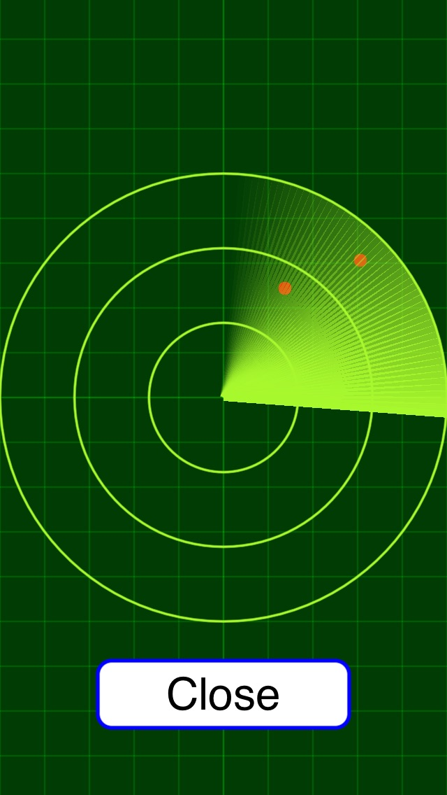

# Sprite-Radar

This sample Xcode project uses SpriteKit to create a radar animation.  The idea comes from おもちゃのレーダー(http://lepetit-prince.net/ios/?p=1633) where they animate a radar with UIView.  Of course, this project is different in that it animates a radar under the SpriteKit framework.  I've created this small project so that I can incorporate it into an SpriteKit game (Emoji World) in development.
